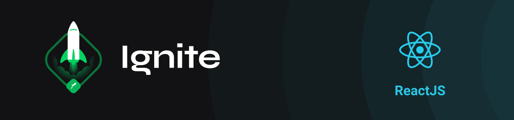
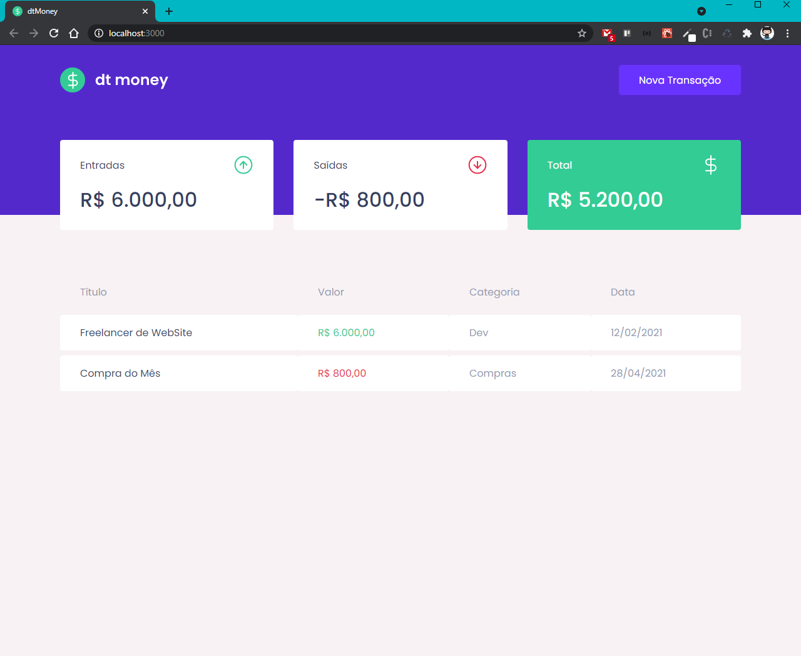
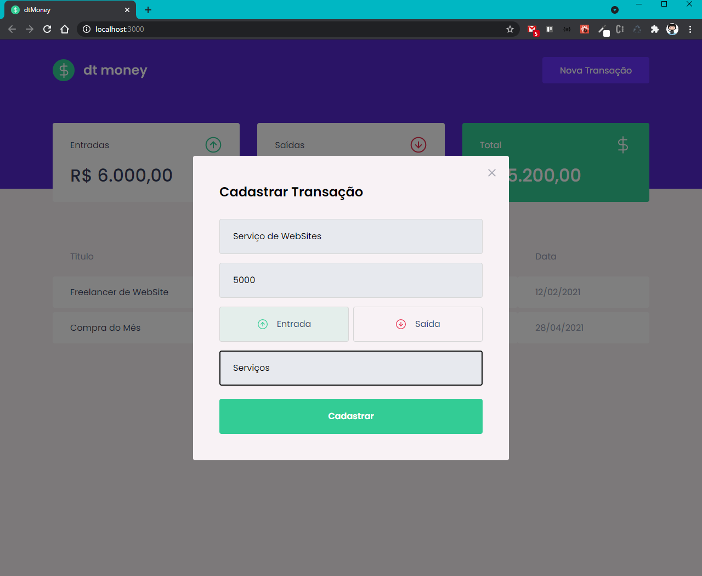
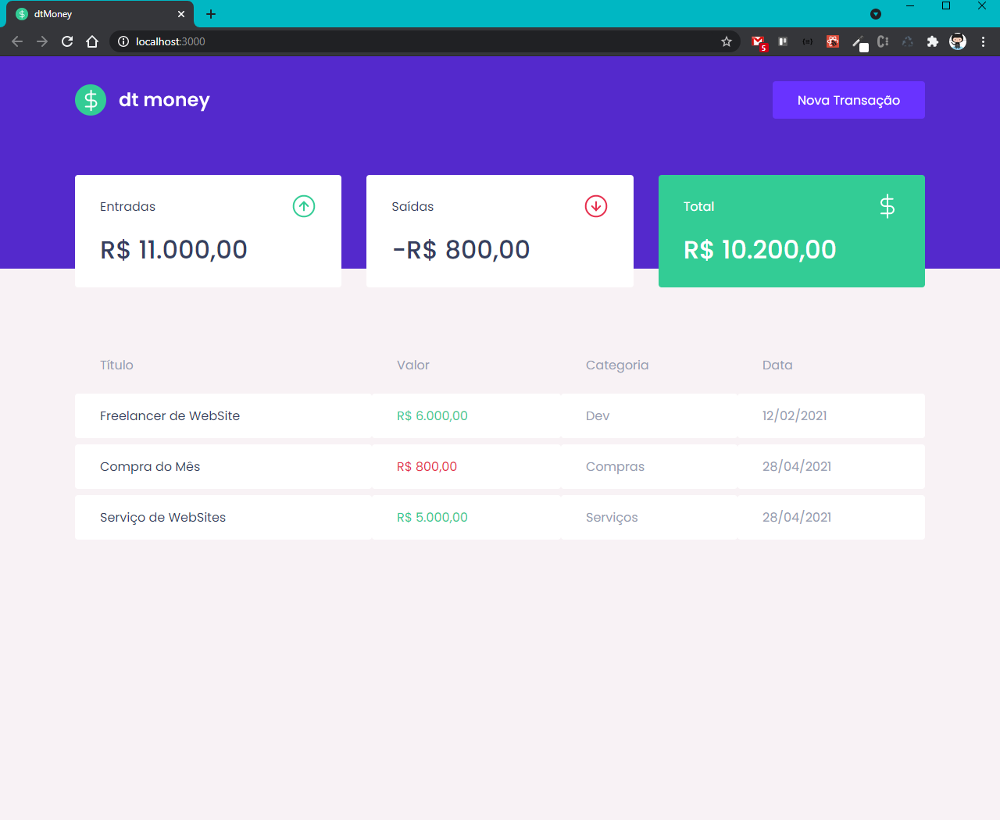

<!-- Logotipo -->
<div align="center">
  
</div>

<!-- Title -->
<h1 align="center"> RocketSeat 🔥 Ignite ReactJS </h1>

<!-- Subtitle -->
<h2 align="center"> Módulo 2 - Primeira aplicação web com React ( DT Money ) </h2>

<!-- Badges -->
<p align="center">
  <a href="https://rocketseat.com.br">
    
  </a>
  
  
  
</p>

<!-- Sobre o Projeto -->
## 🚀 Sobre o Projeto
DT Money é um controle de contas financeiro pessoal que cadastra contas de entrada e saída, totaliza em cards utilizando uma biblioteca de Fake API MirajeJS que utiliza o formato JSON para fazer os cadastros. 

## 🖼️ Imagens do Projeto
<div align="center">
  
</div>
<div align="center">
  
</div>
<div align="center">
  
</div>

## 🧰 Tecnologias e Bibliotecas

* [ReactJS](https://pt-br.reactjs.org/tutorial/tutorial.html)
  * [Styled Component](https://www.npmjs.com/package/styled-components) - Biblioteca CSS in JS
  * [Axios](https://www.npmjs.com/package/axios)
  * [React Modal](https://www.npmjs.com/package/react-modal)
  * [Polished](https://www.npmjs.com/package/polished)
* [TypeScript](https://www.typescriptlang.org/)

### Tools para criar API Fake
 * [MirageJS]()

## ⚙️ Rodando o Projeto
```bash
# Clone este repositório para a pasta anterior
$ git clone https://github.com/brunoemferreira/rocketseat-ignite-dt-money.git
# ou use a opção de download.

# Acesse a pasta dtmoney
$ cd dtmoney

# Instale as dependências
$ yarn install
ou
$ npm install

# Executando o Projeto
$ yarn start 
ou
$ npm start

# Acesse http://localhost:3000 no seu navagador
```
